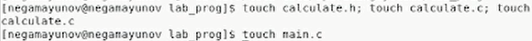
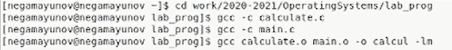
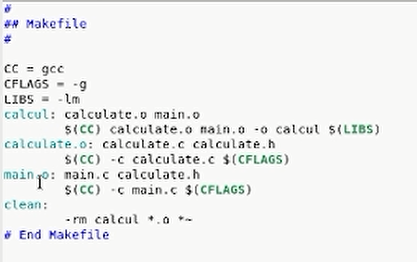
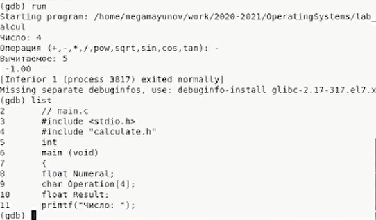
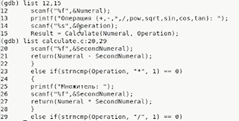
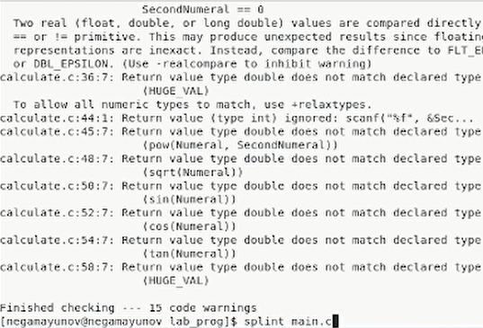

<!-- _class: titleslide -->
# Лабораторная работа №14
### Выполнил Гамаюнов Никита, 1032201719, НПМбд-01-20

---
# Прагматика выполнения работы
**Цель работы**
Приобрести простейшие навыки разработки, анализа, тестирования и отладки приложений в ОС типа UNIX/Linux на примере создания на языке программирования С калькулятора с простейшими функциями.

**Задания**
1. Создать файлы для корректной работы калькулятора
2. Изучить Makefile, исправить имеющийся шаблон
3. На практике воспользоваться gcc для отладки приложения
4. Проверить код с помощью splint

---

# Процесс выполнения работы

1. Создал файлы: `calculate.h`, `calculate.c`, `main.c` *(рисунок 2)*

    

Заполнил из готовыми текстами программ.

---

2. Выполнил компиляцию посредством gcc
   
    

3. Создал и исправил текст Makefile

    
---

4. Выполнил отладку в gdb

 

---

5. С помощью утилиты splint проанализировал коды файлов
calculate.c и main.c

---

<!-- _class: titleslide -->
# Выводы
В ходе выполнения лабораторной работы я приоблёл простейшие навыки разработки, анализа, тестирования и отладки приложений в ОС типа UNIX/Linux на примере создания на языке программирования С калькулятора с простейшими функциями.