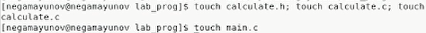
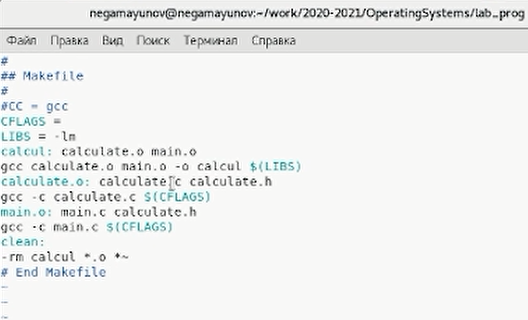
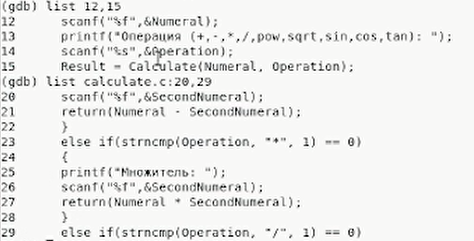
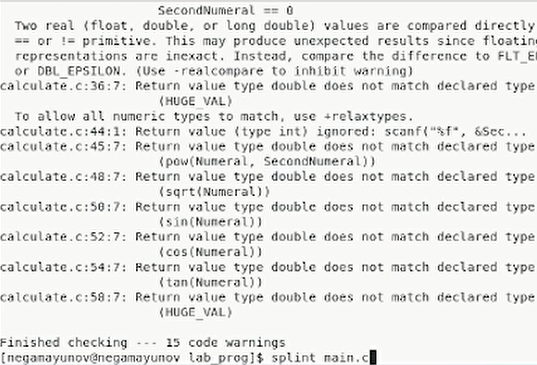

 

# Лабораторная работа №14 

**По дисциплине Операционнные системы** 

Выполнил Гамаюнов Н.Е., студент ФФМиЕН РУДН, НПМбд-01-20, 1032201717

Преподаватель Кулябов Дмитрий Сергеевич

Москва, 2021 г.

 

# Цель работы
Приобрести простейшие навыки разработки, анализа, тестирования и отладки приложений в ОС типа UNIX/Linux на примере создания на языке программирования С калькулятора с простейшими функциями.

# Задания
1. Создать файлы для корректной работы калькулятора
2. Изучить Makefile, исправить имеющийся шаблон
3. На практике воспользоваться gcc для отладки приложения
4. Проверить код с помощью splint

# Выполнение лабораторной работы
1. В домашнем каталоге создал подкаталог `~/work/os/lab_prog` *(рисунок 1)*

    

    Рисунок 1.

2. Создал в нём файлы: `calculate.h`, `calculate.c`, `main.c` *(рисунок 2)*

    

    Рисунок 2.

    Это будет примитивнейший калькулятор, способный складывать, вычитать, умножать и делить, возводить число в степень, брать квадратный корень, вычислять sin, cos, tan. При запуске он будет запрашивать первое число, операцию, второе число. После этого программа выведет результат и остановится.

    Реализация функций калькулятора в файле `calculate.с` - Рисунок 3

    Интерфейсный файл `calculate.h`, описывающий формат вызова функциикалькулятора - Рисунок 5.

    Основной файл `main.c`, реализующий интерфейс пользователя к калькулятору - Рисунок 4.

    

    Рисунок 3.

    

    Рисунок 4.

    

    Рисунок 5.

3. Выполнил компиляцию посредством gcc *(рисунок 6)*: 
   
    

    Рисунок 6.

4. Синтаксических ошибок компилятор не обнаружил.
5. Создал Makefile *(рисунок 7)*, отредактировал его *(рисунок 8)*

    

    Рисунок 7.

    

    Рисунок 8.

    Переменные CC, CFLAGS и LIBS, Заданные в начале, нужны, чтобы облегчить написание программы, - вместо gcc я могу в люблм месте просто написать $CC.

    Далее описываются цели: calcul, calculate.o, main.o и clean
   - после выполнения `make calcul` мы получим исполняемый файл calcul
   - calculate.o и main.o позволяют получить объектные файлы
   - clean удаляет ненужные объектные файлы

6. С помощью gdb выполнил отладку программы calcul *(рисунки 9-12)*:

    Запустил отладчик GDB, загрузив в него программу для отладки:
    
        gdb ./calcul
   - Для запуска программы внутри отладчика ввел команду run:
run
   - Для постраничного (по 9 строк) просмотра исходного код использовал команду list
   - Для просмотра строк с 12 по 15 основного файла использовал list с параметрами:
`list 12,15`
   - Для просмотра определённых строк не основного файла использовал list
с параметрами:
`list calculate.c:20,29`
   - Установил точку останова в файле calculate.c на строке номер 21:

         list calculate.c:20,27
            break 21

   - Вывел информацию об имеющихся в проекте точка останова:
`info breakpoints`
   - Запустил программу внутри отладчика и удебился, что программа остановится в момент прохождения точки останова:
        
          run
          5
          -
          backtrace

   - Посмотрел, чему равно на этом этапе значение переменной Numeral, введя:
`print Numeral`
   - Сравнил с результатом вывода на экран после использования команды:
`display Numeral`

        print выводит название переменной непосредственно из кода программы, а display имеет более понятную форму вывода.
    - Убрал точки останова:

      info breakpoints
      delete 1

      

      Рисунок 9.

      

      Рисунок 10.

        

         Рисунок 11.     

        

        Рисунок 12.  

7. С помощью утилиты splint проанализировал коды файлов
calculate.c и main.c *(рисунок 13)*. В каждой программе нашлись ошибки, в основном, это были проблемы  с несовпадением позвращаемого значения и значения, заданного при инициализации (например, когда переменной типа double присваивается значение float)

    

    Рисунок 13. 

# Выводы 
В ходе выполнения лабораторной работы я приоблёл простейшие навыки разработки, анализа, тестирования и отладки приложений в ОС типа UNIX/Linux на примере создания на языке программирования С калькулятора с простейшими функциями.

# Контрольные вопросы
1. С помощью комадны man.
2. Процесс разработки программного обеспечения обычно разделяется на следующие этапы:
   - планирование, включающее сбор и анализ требований к функционалу и другим характеристикам разрабатываемого приложения;
    -  проектирование, включающее в себя разработку базовых алгоритмов и спецификаций, определение языка программирования;
    - непосредственная разработка приложения:
    - кодирование — по сути создание исходного текста программы (возможно в
нескольких вариантах);
    - анализ разработанного кода;
    - сборка, компиляция и разработка исполняемого модуля;
    - тестирование и отладка, сохранение произведённых изменений;
     -  документирование.
3. Суффикс - это расширение. Например, файлы с расширением (суффиксом) .c воспринимаются gcc как программы на
языке С, файлы с расширением .cc или .C — как файлы на языке C++, а файлы c расширением .o считаются объектными
4. Не только компиляция программы, но и получение исполняемого файла/модуля
5. Для сборки разрабатываемого приложения и собственно компиляции полезно
воспользоваться утилитой make. Она позволяет автоматизировать процесс преобразования файлов программы из одной формы в другую, отслеживает взаимосвязи
между файлами
6. Для работы с утилитой make необходимо в корне рабочего каталога с Вашим
проектом создать файл с названием `makefile` или `Makefile`, в котором будут описаны правила обработки файлов Вашего программного комплекса.
В самом простом случае Makefile имеет следующий синтаксис:

         <цель_1> <цель_2> ... : <зависимость_1>    <зависимость_2>    ...
        <команда 1>
        ...
        <команда n>

    Сначала задаётся список целей, разделённых пробелами, за которым идёт двоеточие и список зависимостей. Затем в следующих строках указываются команды.
    Строки с командами обязательно должны начинаться с табуляции.
    В качестве цели в Makefile может выступать имя файла или название какого-то
    действия. Зависимость задаёт исходные параметры (условия) для достижения указанной цели. Зависимость также может быть названием какого-то действия. Команды — собственно действия, которые необходимо выполнить для достижения цели.

    Рассмотрим пример Makefile для написанной выше простейшей программы, выводящей на экран приветствие ’Hello World!’:

        hello: main.c
            gcc -o hello main.c

    Здесь в первой строке `hello` — цель, `main.c` — название файла, который мы хотим скомпилировать; во второй строке, начиная с табуляции, задана команда компиляции gcc с опциями. Для запуска программы необходимо в командной строке набрать команду make:

        make

    Общий синтаксис Makefile имеет вид:

         target1 [target2...]:[:] [dependment1...]
         [(tab)commands] [#commentary]
         [(tab)commands] [#commentary]

    Здесь знак `#` определяет начало комментария (содержимое от знака `#` и до конца строки не будет обрабатываться. Одинарное двоеточие указывает на то, что последовательность команд должна содержаться в одной строке. Для переноса можно в длинной строке команд можно использовать обратный слэш `\`. Двойное двоеточие указывает на то, что последовательность команд может содержаться в нескольких последовательных строках.

7.  Использование отладчика для поиска и устранения
ошибок в программе существенно облегчает жизнь программиста. В комплект программ GNU для ОС типа UNIX входит отладчик GDB (GNU Debugger).
Для использования GDB необходимо скомпилировать анализируемый код программы таким образом, чтобы отладочная информация содержалась в результирующем бинарном файле. Для этого следует воспользоваться опцией -g компилятора

        gcc:
        gcc -c file.c -g

    После этого для начала работы с gdb необходимо в командной строке ввести одноимённую команду, указав в качестве аргумента анализируемый бинарный файл:

         gdb file.o
    Затем можно использовать по мере необходимости различные команды gdb.

8. Некоторые команды gdb
- backtrace вывод на экран пути к текущей точке останова (по сути
- вывод названий всех функций)
- break установить точку останова (в качестве параметра может
быть указан номер строки или название функции)
- clear удалить все точки останова в функции
continue продолжить выполнение программы
- delete удалить точку останова
- display добавить выражение в список выражений, значения которых отображаются при достижении точки останова программы
- finish выполнить программу до момента выхода из функции
- info breakpoints вывести на экран список используемых точек останова
- info watchpoints вывести на экран список используемых контрольных выражений
- list вывести на экран исходный код (в качестве параметра может быть указано название файла и через двоеточие номера начальной и конечной строк)
- next выполнить программу пошагово, но без выполнения вызываемых в программе функций
- print вывести значение указываемого в качестве параметра выражения
- run запуск программы на выполнение
- set установить новое значение переменной
- step пошаговое выполнение программы
- watch установить контрольное выражение, при изменении значения которого программа будет остановлена

9. Запустил отладчик GDB, загрузив в него программу для отладки:
    
        gdb ./calcul
- Для запуска программы внутри отладчика ввел команду run:
run
- Для постраничного (по 9 строк) просмотра исходного код использовал команду list
- Для просмотра строк с 12 по 15 основного файла использовал list с параметрами:
`list 12,15`
- Для просмотра определённых строк не основного файла использовал list
с параметрами:
`list calculate.c:20,29`
- Установил точку останова в файле calculate.c на строке номер 21:

        list calculate.c:20,27
        break 21

- Вывел информацию об имеющихся в проекте точка останова:
`info breakpoints`
- Запустил программу внутри отладчика и удебился, что программа остановится в момент прохождения точки останова:
        
        run
        5
        -
        backtrace

- Посмотрел, чему равно на этом этапе значение переменной Numeral, введя:
`print Numeral`
- Сравнил с результатом вывода на экран после использования команды:
`display Numeral`
- Убрал точки останова:

      info breakpoints
      delete 1
10. Мой компилятор никак не отреагировал на ошибку в коде (см. скринкаст к работе): в строке `scanf(“%s”, &Operation);` не нужен был знак амперсанда `&`.
11. Например, с помощью утилиты `splint` можно проверить исходный код на ошибки.
12. Эта утилита анализирует программный код, проверяет
74 Лабораторная работа № 11. Средства, применяемые при разработке программного…
корректность задания аргументов использованных в программе функций и типоввозвращаемых значений, обнаруживает синтаксические и семантические ошибки.

>Источник всей информации, которой я пользовался для ответа на вопросы и выполнения работы - [Методические рекомендации к лабораторной работе №14](https://esystem.rudn.ru/pluginfile.php/1142099/mod_resource/content/2/011-lab_prog.pdf)

# Библиография

- [Кулябов Д.С. и др. Операционные системы. Методические рекомендации к лабораторной работе №14](https://esystem.rudn.ru/pluginfile.php/1142099/mod_resource/content/2/011-lab_prog.pdf)